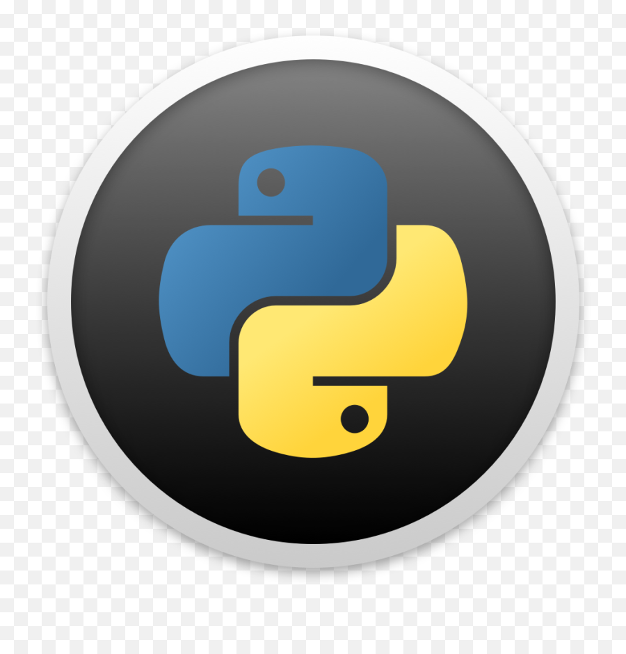

 <h1>Curso Basico de Python</h1>

  

# Introducción:

Este es un curso de Introducctorio al **lenguaje de Programación Python**.

En este repositorio encontraras Los ejemplos del Profesor [aquí](./solveds),
mientras que todos mis ejercicios estaran [aquí](./exercises).

Las notas del curso estan [aquí](./notes.md).

**Si es que este repositorio le fue util, o simplemente le gusto,considere darle una estrella.**
